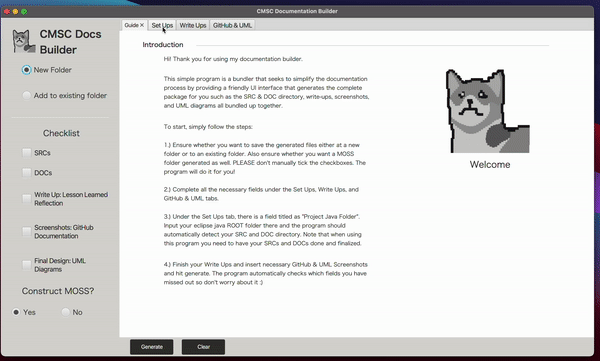

# CMSC Docs Builder

This simple program is a bundler that seeks to amplify the documentation process by 
providing a friendly UI interface that generates the complete package for a CMSC student
such as the SRC & DOC directory, write-ups, screenshots, and UML diagrams all bundled up together. 

## 
  
With using this program, one can get rid of the hassle and save time due to problems such as manually creating documentation
documents, copying and pasting them into select directories, and having the risk of forgetting a project 
documentation requirement. This will mitigate those.  

## Deployment

IF YOU HAVE MAC:  
You can do this in two ways:

Method A (installation through .app.zip):  
1.) Look at the sidebar and under Releases, choose the latest Release.  
2.) Follow the procedures outlined in the Release Notes.

Method B (installation through sourcecode.zip):  
1.) Look at the sidebar and under Releases, choose the latest Release.  
2.) Install the sourcecode.zip that can be located in the bottom of the page.  
3.) Open the .zip folder and under the directory CMSCBuilderMACOSX, click the .app main icon.  
4.) There will be a warning message such as: "“CMSCBuilder” cannot be opened because the developer cannot be verified."
This is pretty normal for indie-apps that are not installed through the App Store due to certificates.   

Bypass this by:
Press command + space (for spotlight search) -> Security & Privacy -> General -> Open Anyway -> Open.  
NOTE: This security bypassing issue is a one-time procedure. You can put the main app whichever location of your storage and it will be opened through clicking.

IF YOU HAVE WINDOWS:
This app may not be ready for windows distribution.  
However, there is a work around for this!  

Installation through sourcecode.zip:  
1.) Look at the sidebar and under Releases, choose the latest Release.  
2.) Install the sourcecode.zip that can be located in the bottom of the page.  
3.) Open the .zip folder and proceed with the following:  
src -> main -> java -> com -> example -> cmscdocs -> (Then run the) Main.java.  

NOTE: IF EVER YOU IMPLEMENT A SOLUTION THAT PACKAGES ALL THE DEPENDENCIES, OTHER LIBRARIES, AND ALL
OTHER JARs INTO A BUNDLED .EXE FILE, PLEASE DO LET ME KNOW AND PULL A REQUEST FOR WINDOWS DISTRIBUTION

## Acknowledgements
Without these resources, I don't think I could accomplish such a project
- [Turning a JAVAFX app into a Runnable App](https://www.youtube.com/watch?v=IoPXzopsmpE&ab_channel=AD2)
- [Converting a .jar into a Mac OS X app | Easy way to create Mac App from jar](https://www.youtube.com/watch?v=ZI3U4I2nK2s&ab_channel=CoolITHelp)
- [Configuring Maven For Java FX](https://www.youtube.com/watch?v=RVzGvuM5syA&ab_channel=SnatchedAF)
- [Export and Deploy JavaFX 12+ Application! Using IntelliJ and Maven.](https://www.youtube.com/watch?v=yG8YCLYccVo&t=250s&ab_channel=ByteSmyth)
- [Caused by: java.lang.IllegalAccessError: superclass access check class apache (in module x) that cannot access another apache class (in mod y)](https://stackoverflow.com/questions/70320899/caused-by-java-lang-illegalaccesserror-superclass-access-check-class-apache-i)

